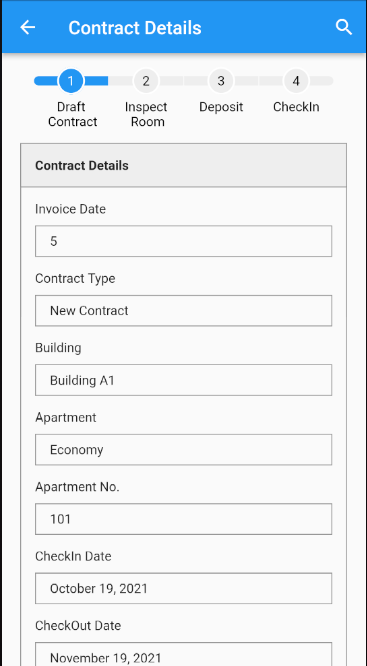

StepIndicator is a package that lets you create progressing timeline easier with number of steps and easy to customize.

## Features

int count;
double indicatorRadius;
int currentStep;
Color indicatorColor;
Color activeIndicatorColor;
double lineWidth;
double lineHeight;
double lineRadius;
Color lineColor;
Color activeLineColor;
Color indicatorBorderColor;
double indicatorBorderWidth;
final TextStyle numberStyle;
TextStyle activeNumberStyle;
double lineSpacing;
List<String> stepTitles;
bool enableStepTitle;
TextStyle stepTitleStyle;

## Usage

import 'package:step_indicator/step_indicator.dart';

## Screenshot

